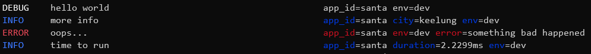

# log [![GoDoc][doc-img]][doc] [![Build][ci-img]][ci] [![Coverage Status][cov-img]][cov] [![GoReport][report-img]][report]

It is a simple structured logging package for Go. 
## Features
* fast, easy to use, and pretty logging for development
* low to zero allocation
* JSON encoding format
* support multiple output and each output can have their own output level 
* colored text for console handler (`linux`, `mac`, and `windows` are supported)
* `context.Context` integration

## Handlers
* console
* gelf (graylog)
* memory (unit test)
* discard (benchmark)

## Installation
Use go get 

```go
go get -u github.com/jasonsoft/log/v2
```

## Get Started

```go
package main

import (
	"errors"

	"github.com/jasonsoft/log"
	"github.com/jasonsoft/log/handlers/console"
)

func main() {
	// use console handler to log all level logs
	clog := console.New()
	log.AddHandler(clog, log.AllLevels...)

	// print message use DEBUG level
	logger.Debug("hello world")
}

```


## Example

```go
package main

import (
	"errors"

	"github.com/jasonsoft/log"
	"github.com/jasonsoft/log/handlers/console"
)

func main() {
	// use console handler to log all level logs
	clog := console.New()
	log.AddHandler(clog, log.AllLevels...)

	// optional: allow handlers to clear all buffer
	defer log.Flush()

	// use trace to get how long it takes
	defer log.Trace("time to run").Stop()

	logger := log.
		Str("app_id", "santa").
		Str("env", "dev")

	// print message use DEBUG level
	logger.Debug("hello world")

	// log information with custom fileds
	logger.Str("city", "keelung").Info("more info")

	// log error struct and print error message, stack trace will also be recorded
	err := errors.New("something bad happened")
	logger.Err(err).Error("oops...")
}
```
Output



## Field Types

### Standard Types

* `Str`
* `Bool`
* `Int`, `Int8`, `Int16`, `Int32`, `Int64`
* `Uint`, `Uint8`, `Uint16`, `Uint32`, `Uint64`
* `Float32`, `Float64`


## Benchmarks

Run on MacBook Pro 15-inch 2018 using go version go1.14.2 windows 10 OS

Using Uber's zap comparison benchmark:

Log a static string, without any context or `printf`-style templating:

| Library | Time | Bytes Allocated | Objects Allocated |
| :--- | :---: | :---: | :---: |
| jasonsoft log | 134 ns/op | 0 B/op | 0 allocs/op |
| zerolog | 82 ns/op | 0 B/op | 0 allocs/op |
| :zap: zap | 101 ns/op | 0 B/op | 0 allocs/op |
| standard library | 339 ns/op | 80 B/op | 2 allocs/op |
| :zap: zap (sugared) | 187 ns/op | 80 B/op | 2 allocs/op |
| go-kit | 349 ns/op | 640 B/op | 11 allocs/op |
| logrus | 3217 ns/op | 1195 B/op | 24 allocs/op |
| apex/log | 1766 ns/op | 344 B/op | 6 allocs/op |
| log15 | 5157 ns/op | 1195 B/op | 24 allocs/op |

Log a message with a logger that already has 10 fields of context:

| Library | Time | Bytes Allocated | Objects Allocated |
| :--- | :---: | :---: | :---: |
| jasonsoft log | 469 ns/op | 0 B/op | 0 allocs/op |
| zerolog | 78 ns/op | 0 B/op | 0 allocs/op |
| :zap: zap | 101 ns/op | 0 B/op | 0 allocs/op |
| :zap: zap (sugared) | 168 ns/op | 80 B/op | 2 allocs/op |
| go-kit | 5979 ns/op | 3793 B/op | 58 allocs/op |
| logrus | 25518 ns/op | 4186 B/op | 68 allocs/op |
| apex/log | 23583 ns/op | 3406 B/op | 55 allocs/op |
| log15 | 21155 ns/op | 3446 B/op | 72 allocs/op |

Log a message and 10 fields:

| Library | Time | Bytes Allocated | Objects Allocated |
| :--- | :---: | :---: | :---: |
| jasonsoft log | 7439 ns/op | 15086 B/op | 42 allocs/op |
| zerolog | 3906 ns/op | 2614 B/op | 32 allocs/op |
| :zap: zap | 966 ns/op | 772 B/op | 5 allocs/op |
| :zap: zap (sugared) | 1651 ns/op | 1570 B/op | 11 allocs/op |
| go-kit | 5367 ns/op | 3470 B/op | 60 allocs/op |
| logrus | 30444 ns/op | 5772 B/op | 80 allocs/op |
| apex/log | 25479 ns/op | 4363 B/op | 67 allocs/op |
| log15 | 30315 ns/op | 6859 B/op | 77 allocs/op |


[doc-img]: https://godoc.org/github.com/jasonsoft/log?status.svg
[doc]: https://pkg.go.dev/github.com/jasonsoft/log?tab=doc
[ci-img]: https://github.com/jasonsoft/log/workflows/build/badge.svg
[ci]: https://github.com/jasonsoft/log/actions
[cov-img]: https://codecov.io/gh/jasonsoft/log/branch/master/graph/badge.svg
[cov]: https://codecov.io/gh/jasonsoft/log
[report-img]: https://goreportcard.com/badge/github.com/jasonsoft/log
[report]: https://goreportcard.com/report/github.com/jasonsoft/log